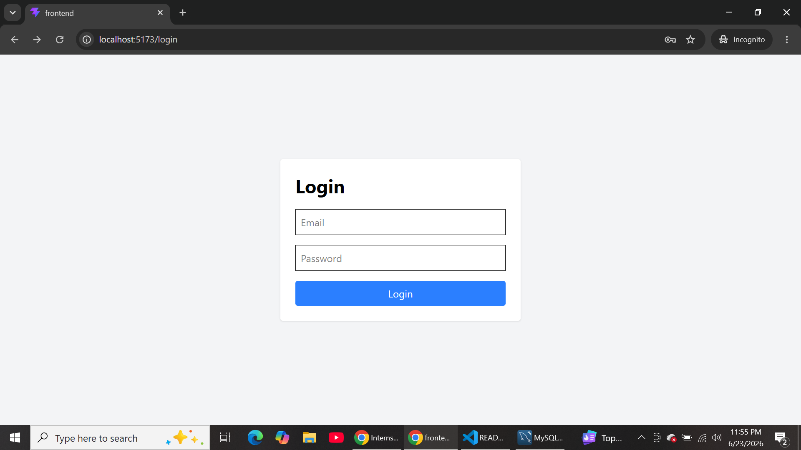
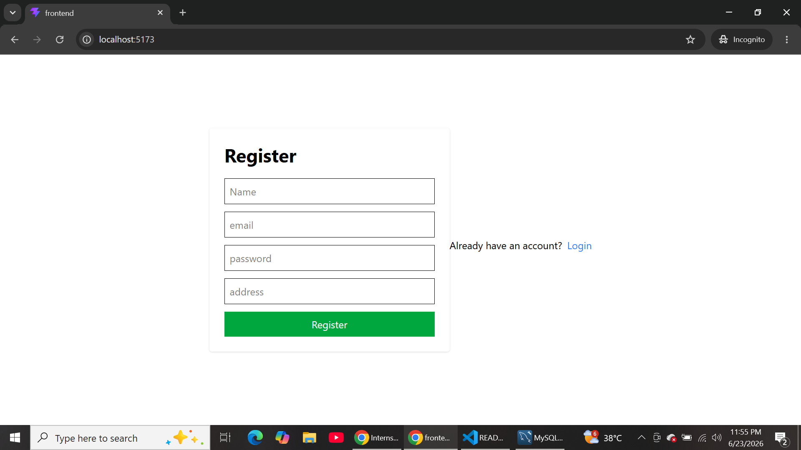
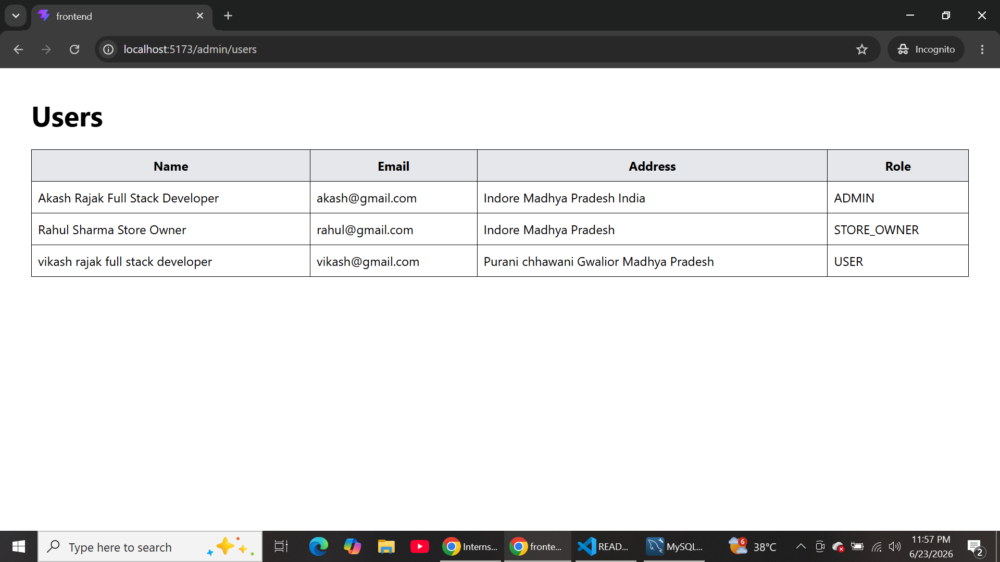
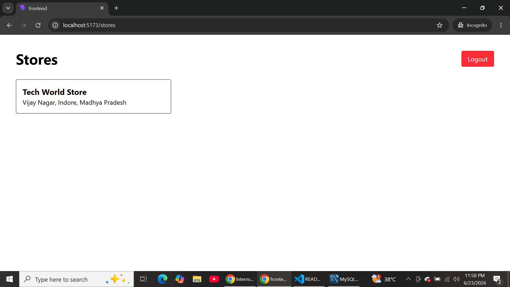
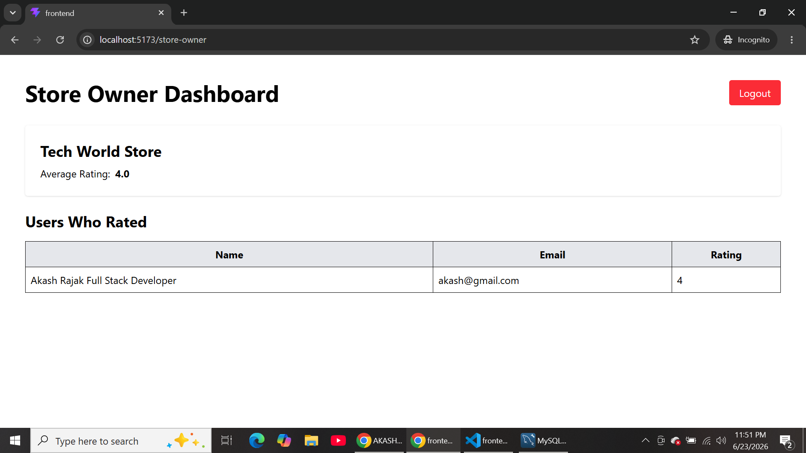
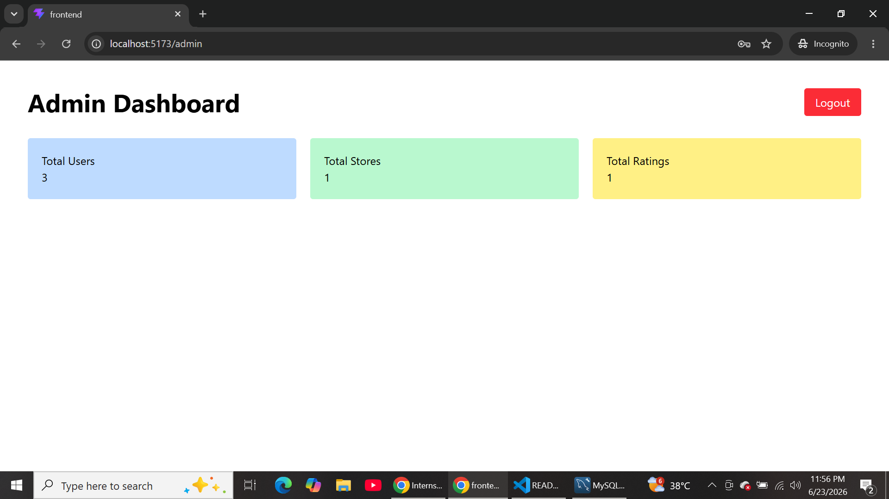

# Store Rating Platform

A Full Stack Web Application where users can register, login, view stores, submit ratings, and manage store-related information based on their roles.

## Tech Stack

### Frontend
- React.js
- React Router DOM
- Axios
- Tailwind CSS
- Vite

### Backend
- Node.js
- Express.js
- JWT Authentication
- bcrypt

### Database
- MySQL

---

## Features

### Authentication
- User Registration
- User Login
- JWT Based Authentication
- Role Based Authorization
- Update Password
- Logout

### Admin
- Dashboard Statistics
  - Total Users
  - Total Stores
  - Total Ratings
- View All Users
- View User Details
- Create Stores
- Search & Filter Users

### Normal User
- View All Stores
- Submit Rating
- Update Existing Rating
- Search Stores

### Store Owner
- View Store Dashboard
- View Average Rating
- View Users Who Rated Their Store

---

## Database Schema

### Users

| Field | Type |
|---------|---------|
| id | INT |
| name | VARCHAR |
| email | VARCHAR |
| password | VARCHAR |
| address | VARCHAR |
| role | ENUM |

### Stores

| Field | Type |
|---------|---------|
| id | INT |
| name | VARCHAR |
| email | VARCHAR |
| address | VARCHAR |
| owner_id | INT |

### Ratings

| Field | Type |
|---------|---------|
| id | INT |
| user_id | INT |
| store_id | INT |
| rating | INT |

---

## Installation

### Backend

```bash
cd backend
npm install
npm run dev
```

### Frontend

```bash
cd frontend
npm install
npm run dev
```

---

## Environment Variables

Create a `.env` file inside backend folder:

```env
PORT=5000
JWT_SECRET_KEY=your_secret_key

DB_HOST=localhost
DB_USER=root
DB_PASSWORD=your_password
DB_NAME=store_rating
```

---

## API Endpoints

### Authentication

```http
POST /user/register
POST /user/login
PUT /user/update-password
```

### Admin

```http
GET /admin/dashboard
GET /admin/users
GET /admin/user/:id
```

### Stores

```http
POST /store/create
GET /store
```

### Ratings

```http
POST /rating/submit
PUT /rating/update/:storeId
```

### Store Owner

```http
GET /store-owner/dashboard
```

---

## Screenshots

Add screenshots of:

### Login page
- 

### Register page
- 

### Users page
- 

### Stores page
- 

### Store-owner Dashboard page
- 

### Admin Dashboard page
- 

---

## Author

Akash Rajak

B.Tech Computer Science Engineering

Full Stack Developer (MERN)

GitHub: https://github.com/AKASH259150/